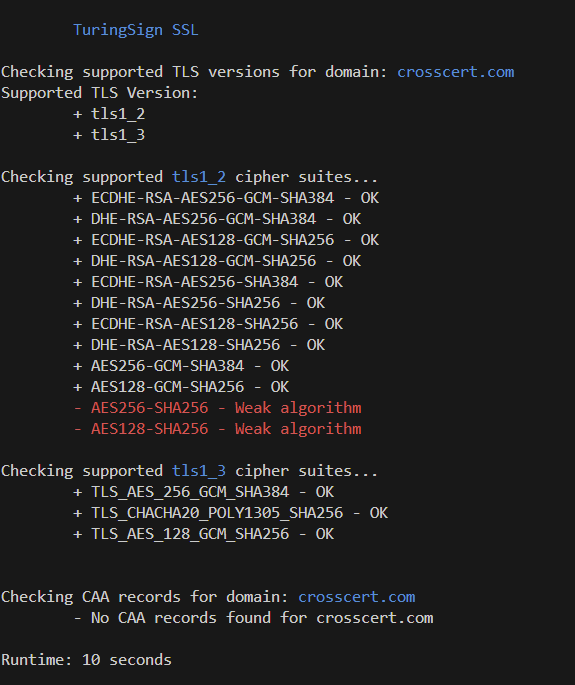
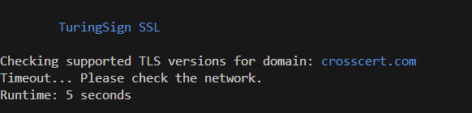

# TS TLS Checker
1. Prints supported tls versions.
2. Prints supported algorithms.
3. Prints CAA records

## Setup
1. Modify [black list](ts_tls_blacklist.sh)
    - tls_version_blacklist
    - cipher_suites_blacklist

## Run
```bash
chmod u+x ./ts_tls_checker.sh
./ts_tls_checker.sh [YOUR_DOMAIN]
```

## TEST

- SUCCESS

    

- Timeout

    